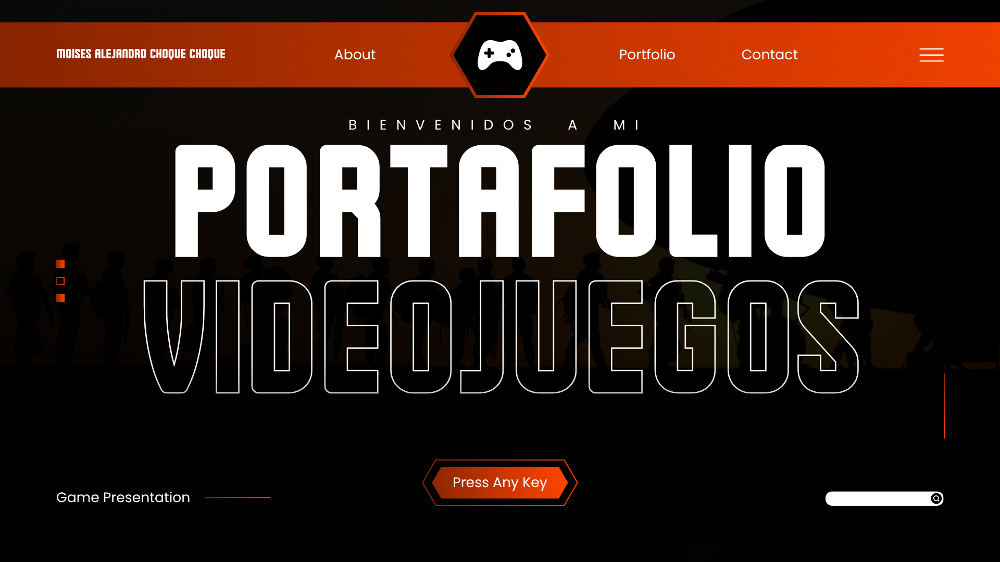
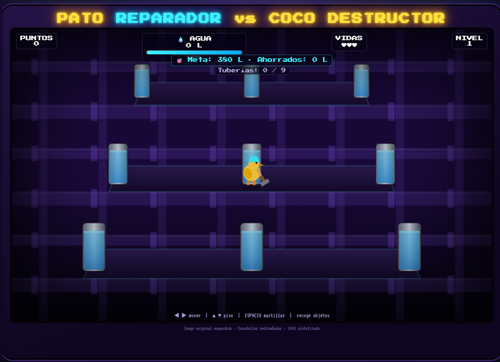
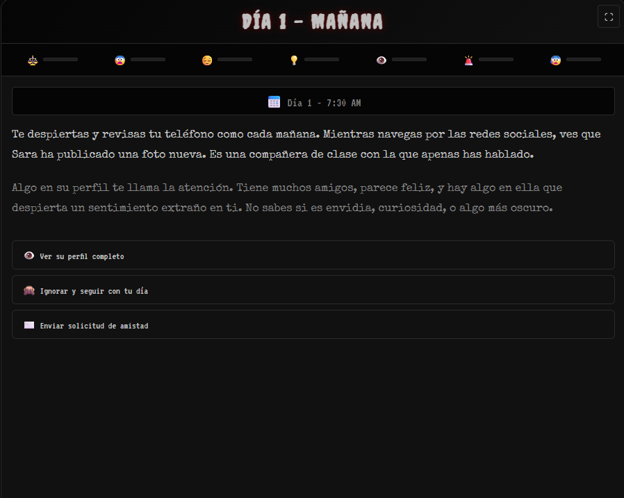
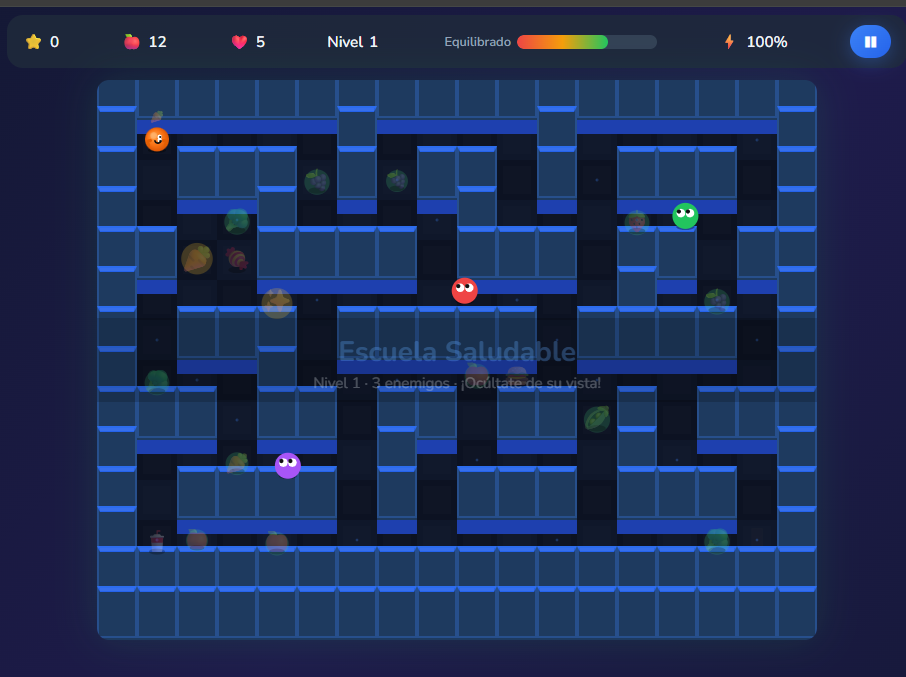
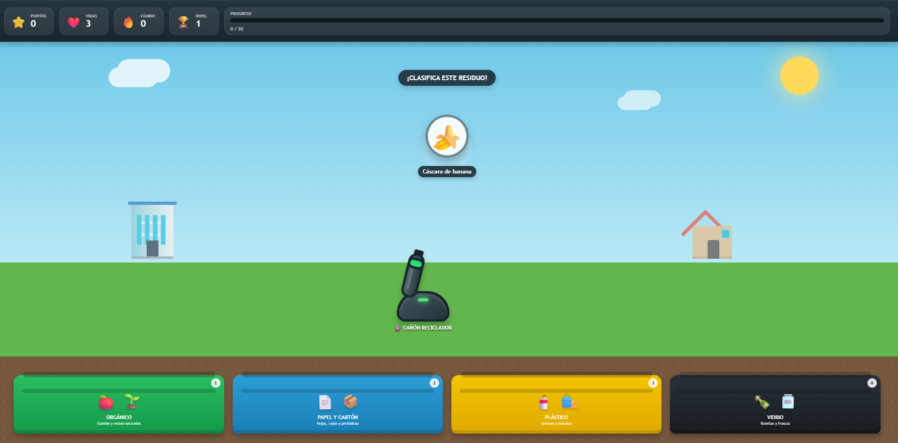
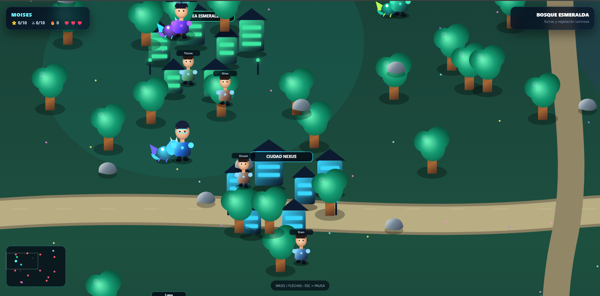

 
# 🎮 MOISÉS ALEJANDRO
<h3>Game Developer • Software Developer • Creative Technologist</h3>

🇧🇴 Bolivia &nbsp;•&nbsp;
🎮 Game Development &nbsp;•&nbsp;
💻 Software Development &nbsp;•&nbsp;
🚀 Interactive Experiences

 

&nbsp;

&nbsp;

 
<h2>👾 Sobre mí</h2>

Hola, soy <strong>Moisés Alejandro</strong>, estudiante de Ingeniería de Sistemas Informáticos en la Universidad del Valle (Univalle), Bolivia.

Me interesa el desarrollo de software, la creación de videojuegos y la construcción de experiencias interactivas. Me gusta experimentar con nuevas tecnologías, aprender mediante proyectos y transformar ideas en aplicaciones funcionales.

🎮 Este repositorio reúne algunos de los videojuegos que he desarrollado como parte de mi aprendizaje y exploración en el mundo del desarrollo de videojuegos.

 

<h2>⚡ GAME DEV MODE: ON</h2>

<em>
"Create. Play. Learn. Repeat."
</em>

 
<h2>🛠️ Tecnologías</h2>
<h3>🎮 Desarrollo</h3>

<h3>🔧 Herramientas</h3>

 
<h2 id="-mis-videojuegos">🎮 Mis Videojuegos</h2>

Una colección de videojuegos desarrollados durante mi proceso de aprendizaje.
Cada proyecto experimenta con diferentes mecánicas, diseños y tecnologías.

 
<!-- ======================= JUEGO 1 ======================= -->
<table>
<tr>
<td width="50%">

</td>
<td width="50%">
<h2>💰 Juego Ahorro</h2>

Videojuego educativo enfocado en el aprendizaje y la toma de decisiones relacionadas con el ahorro y el manejo del dinero.

<strong>🎯 Género:</strong> Educativo / Casual

<strong>⚙️ Tecnología:</strong> HTML5 • CSS3 • JavaScript

 

 

</td>
</tr>
</table>
 
<!-- ======================= JUEGO 2 ======================= -->
<table>
<tr>
<td width="50%">
<h2>🐂 Bull E</h2>

Videojuego interactivo diseñado alrededor de una experiencia de juego dinámica y entretenida.

<strong>🎯 Género:</strong> Arcade / Casual

<strong>⚙️ Tecnología:</strong> HTML5 • CSS3 • JavaScript

 

 

</td>
<td width="50%">

</td>
</tr>
</table>
 
<!-- ======================= JUEGO 3 ======================= -->
<table>
<tr>
<td width="50%">

</td>
<td width="50%">
<h2>💵 Juego Dinero</h2>

Videojuego educativo orientado al reconocimiento, manejo y utilización del dinero mediante diferentes desafíos interactivos.

<strong>🎯 Género:</strong> Educativo / Puzzle

<strong>⚙️ Tecnología:</strong> HTML5 • CSS3 • JavaScript

 

 

</td>
</tr>
</table>
 
<!-- ======================= JUEGO 4 ======================= -->
<table>
<tr>
<td width="50%">
<h2>🥦 Nutrimaze</h2>

Una aventura educativa donde el jugador debe superar desafíos relacionados con la alimentación y los hábitos saludables.

<strong>🎯 Género:</strong> Aventura / Educativo / Maze

<strong>⚙️ Tecnología:</strong> HTML5 • CSS3 • JavaScript

 

 

</td>
<td width="50%">

</td>
</tr>
</table>
 
<!-- ======================= JUEGO 5 ======================= -->
<table>
<tr>
<td width="50%">

</td>
<td width="50%">
<h2>♻️ Juego Reciclaje</h2>

Videojuego educativo que busca enseñar conceptos relacionados con el reciclaje y el cuidado del medio ambiente mediante mecánicas interactivas.

<strong>🎯 Género:</strong> Educativo / Casual

<strong>⚙️ Tecnología:</strong> HTML5 • CSS3 • JavaScript

 

 

</td>
</tr>
</table>
 
<!-- ======================= JUEGO 6 ======================= -->
<table>
<tr>
<td width="50%">
<h2>🐉 Dragon Math Adventure</h2>

Aventura de exploración en el mundo de Draconia. Encuentra a los 10 guardianes y derrota cada uno resolviendo desafíos matemáticos de suma, resta, multiplicación y división.

<strong>🎯 Género:</strong> Aventura / Educativo / RPG

<strong>⚙️ Tecnología:</strong> HTML5 • CSS3 • JavaScript • Canvas

 

 

</td>
<td width="50%">

</td>
</tr>
</table>
 

 
<h2 id="-sobre-el-proyecto">🚀 Sobre este portafolio</h2>

Este repositorio funciona como un portafolio de videojuegos donde documento y presento diferentes proyectos desarrollados durante mi formación como estudiante de Ingeniería de Sistemas.

Cada videojuego cuenta con su propio directorio dentro de <code>games/</code>, mientras que los recursos visuales utilizados para presentar el portafolio se encuentran en <code>assets/</code>.

 

<h2>🎮 MORE GAMES LOADING...</h2>

<strong>████████████████████░░░░ 80%</strong>

🚧 More projects coming soon...

 

  
Made with 💜 by Moisés Alejandro 🇧🇴

