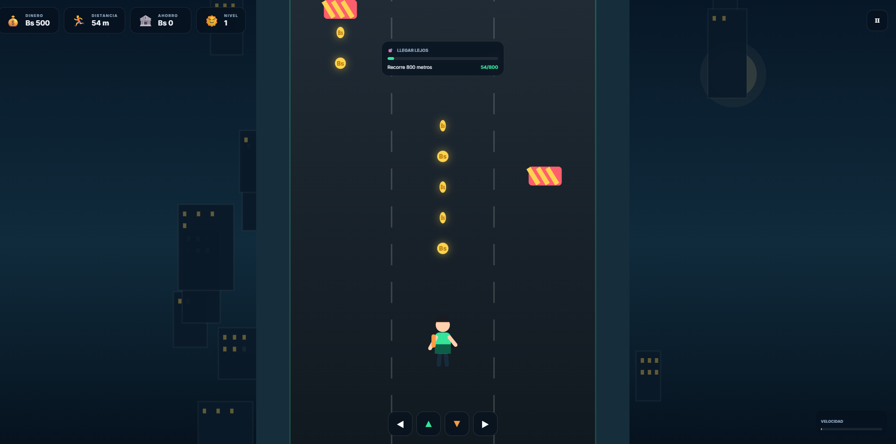

# 💰 Money Runner

Videojuego arcade educativo de carrera infinita (endless runner) centrado en la **administración del dinero**.  
Corre por la ciudad, recolecta monedas, esquiva obstáculos y aprende a decidir qué hacer con tu dinero: **gastar, ahorrar o invertir en herramientas útiles**.

## 📝 Descripción

**Money Runner** es un juego educativo en el que el jugador controla a un personaje que corre por tres carriles en una ciudad.  
El objetivo no es solo conseguir la mayor cantidad de dinero posible, sino **saber qué hacer con él**.

Durante la carrera recolectas monedas (Bs), completas misiones financieras y al finalizar puedes comprar objetos en la tienda.  
Cada compra tiene un efecto real en el gameplay y afecta tu **puntaje de responsabilidad financiera**.

## 🎯 Objetivo del jugador

- Recorrer la mayor distancia posible.
- Recolectar monedas.
- Completar misiones financieras.
- Ahorrar parte del dinero ganado.
- Comprar solo lo necesario (necesidades vs deseos).
- Mejorar tu **puntuación de responsabilidad financiera**.

## 🎮 Género

- Arcade
- Endless Runner
- Educational

## 🕹️ Controles

| Tecla / Acción          | Acción                  |
|-------------------------|-------------------------|
| ← o **A**               | Mover a la izquierda    |
| → o **D**               | Mover a la derecha      |
| ↑ o **W** o **Espacio** | Saltar                  |
| ↓ o **S**               | Deslizarse              |
| **P**                   | Pausar                  |
| Botones en pantalla     | Controles táctiles      |
| Swipe en el canvas      | Mover / saltar / deslizar |

## 💡 Mecánica principal

### Durante la carrera
- Corre automáticamente por 3 carriles.
- Recolecta monedas 🪙 (valor base 10 Bs, se puede duplicar).
- Esquiva **autos** (salta) y **barreras** (deslízate).
- Activa power-ups temporales:
  - 🛡️ Escudo
  - 🧲 Imán de monedas
  - ⚡ Multiplicador ×2

### Sistema de misiones
Cada carrera tiene una misión aleatoria:
- Recolectar X monedas
- Recorrer X metros
- Ahorrar cierta cantidad

Al completar una misión recibes una recompensa directa en tu **ahorro**.

### Tienda e Inventario
Al terminar la carrera puedes gastar el dinero ganado:

| Categoría     | Ejemplos                          | Efecto real en el juego                          |
|---------------|-----------------------------------|--------------------------------------------------|
| 🟢 Útiles     | Mochila, Zapatillas, Cuaderno     | Mejoran magnetismo, salto, recompensas de misión |
| 🟡 Deseos     | Audífonos, Consola, Hamburguesa   | Ventajas temporales pero penalizan el score      |
| ⚡ Power-ups  | Escudo, Imán, Multiplicador       | Se activan automáticamente al inicio de la carrera |

- Las **hamburguesas** 🍔 se convierten en escudos de emergencia (se consumen al chocar).
- Las compras de tipo “necesidad” mejoran tu responsabilidad financiera.
- Las compras de tipo “deseo” la empeoran.

### Sistema de ahorro y puntuación
Al final de cada carrera se genera un **Reporte Financiero**:
- % gastado en Necesidades
- % gastado en Deseos
- % Ahorrado
- **Responsabilidad Financiera** (0-100%)

## 🏆 Condiciones de victoria / derrota

- **Victoria**: llegar a 3000 metros.
- **Derrota**: chocar sin escudo ni hamburguesas de emergencia.

## 📸 Captura de pantalla



La captura muestra el juego **Money Runner**, con la carrera por la ciudad, el HUD de dinero/ahorro y las mecánicas de recolección.

## 📊 Características técnicas

- HTML5 Canvas + JavaScript puro (sin dependencias externas)
- Guardado local (`localStorage`)
- Responsive + controles táctiles + swipe
- Sistema de audio procedural (Web Audio API)
- Partículas, flash de pantalla, shake y animaciones de squash & stretch
- Ciclo día → atardecer → noche según la distancia

## ▶️ Cómo jugar

1. Abre el archivo `index.html` en cualquier navegador moderno.
2. O sirve la carpeta con un servidor local:

```bash
cd juegoDinero
python3 -m http.server 8080
